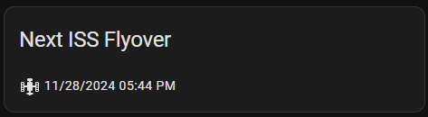

# ISS Spotter Integration for Home Assistant

The **ISS Spotter** integration for Home Assistant allows you to track upcoming ISS (International Space Station) sightings based on your location. This integration fetches data from the NASA Spot The Station website and presents it in Home Assistant as a `sensor` with the next visible sighting and additional details in the attributes.

## Features
- Displays the next ISS sighting time.
- Shows additional details, including duration, maximum elevation, and where the ISS will appear and disappear in the sky.
- Number of Astronauts on ISS and their names (from open-notify).
- Automatically updates when new sighting data is available.
- Filter for maximum elevation
- Creates a senosr entity that way it is easy to get notified when the ISS will show up.

## Installation

1. **Install via HACS:**
   - Open Home Assistant and go to **HACS**.
   - Click on the three dots in the upper right corner
   - Custom Repositories and add this repos url
   - Search for **ISS Spotter**.
   - Click **Install**.

2. **Manual Installation:**
   - Download or clone this repository.
   - Place the `iss_spotter` folder in your Home Assistant `custom_components` directory.
     ```bash
     /config/custom_components/iss_spotter/
     ```

3. Restart Home Assistant to load the integration.

## Configuration

### **Add the Integration via UI:**

- Go to **Configuration** > **Integrations** in Home Assistant.
- Click **+ Add Integration** and search for **ISS Spotter**.
- Enter the URL for the ISS sighting data (e.g., [Germany Freiburg im Breisgau](https://spotthestation.nasa.gov/sightings/view.cfm?country=Germany&region=None&city=Freiburg_im_Breisgau)).
- Set a minimal height it should reach.
- The integration will automatically create a sensor entity and fetch the sighting data.

### **How to Get the Correct URL for ISS Sightings**

To get the correct URL for the ISS sightings based on your location, follow these steps:

1. **Visit the NASA Spot the Station Website:**

   - Go to [NASA Spot the Station](https://spotthestation.nasa.gov/).

2. **Enter Your Location:**

   - Enter your location in the **"City"** field. You can enter your city or a nearby city.

3. **Get the URL:**

   - After entering your location, you will see a map where you can choose the nearest viewpoint. Click on it.
   - Look at the **URL** in your browser’s address bar. It should look something like this:
     ```
     https://spotthestation.nasa.gov/sightings/view.cfm?country=Germany&region=None&city=Freiburg_im_Breisgau
     ```
   - This URL is the one you need to use in the **ISS Spotter** integration configuration.

4. **Use the URL in Home Assistant:**

   - Copy the URL from your browser's address bar and paste it into the configuration of the **ISS Spotter** integration in Home Assistant.


## Notification

### pyscript

```python
from datetime import datetime, timedelta

time_triggers = {}
time_in_minutes_to_notify_before = 3

@time_trigger("startup")
@state_trigger("sensor.iss_freiburg_im_breisgau")
def time_trigger_start_time():
    date = str(state.get("sensor.iss_freiburg_im_breisgau"))
    attributes = state.getattr("sensor.iss_freiburg_im_breisgau")
    visible_time = str(attributes["duration"])
    max_height = str(attributes["max_elevation"])
    service.call("notify", "smarpthone", message="🌍🛰️New date for ISS sighting: " + date + "\nIt will be visible for " + visible_time + " and it will reach a height of " + max_height + ".")
    time_trigger_factory("sensor.iss_freiburg_im_breisgau",notify_Func,"notify_Func","my_args")

def notify_Func(arg):
    attributes = state.getattr("sensor.iss_freiburg_im_breisgau")
    visible_time = str(attributes["visible"])
    max_height = str(attributes["max_height"])
    service.call("notify", "smartphone", message="👀🛰️The ISS will be visible IN " + str(time_in_minutes_to_notify_before) + " MINUTES! It will be visible for " + visible_time + " and it will reach a height of " + max_height + ".")

def time_trigger_factory(sensor_entity,func_handle,func_name,*args,**kwargs):
    time_val = datetime.fromisoformat(str(state.get(sensor_entity))) - timedelta(minutes=time_in_minutes_to_notify_before)
    time_val = time_val.strftime('%Y-%m-%d %H:%M:%S')

    @time_trigger(f"once({time_val})")
    def func_trig():
        nonlocal args, kwargs
        func_handle(*args,**kwargs)

    time_triggers[func_name] = func_trig
```


### yaml

```yaml
alias: ISS Notification
description: "Send a notification 3 minutes before the ISS sighting."
trigger:
  - platform: template
    value_template: >
      {{ (as_timestamp(states('sensor.iss_freiburg_im_breisgau')) - as_timestamp(now())) <= 180 }}
condition: []
action:
  - service: notify.mobile_app_your_device_name
    data:
      title: "ISS sighting soon!"
      message: >
        The ISS will be visible in 3 minutes! Next sightings:
        {{ states('sensor.iss_freiburg_im_breisgau') }}.
      data:
        tag: iss_notification
mode: single
```


## GUI

### Markdown card
```markdown
<ha-icon icon="mdi:space-station"></ha-icon>  {{ as_datetime(states('sensor.iss_freiburg_im_breisgau')).strftime('%m/%d/%Y %I:%M %p') }}
```
