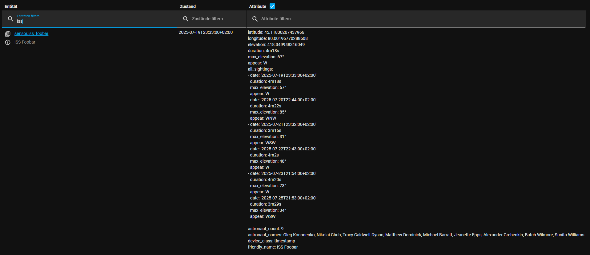

# ISS Spotter Integration for Home Assistant

The **ISS Spotter** custom integration lets you track upcoming ISS (International Space Station) sightings for **your exact location**.
It uses the [Skyfield](https://rhodesmill.org/skyfield/) library and live TLE data from [Celestrak](https://celestrak.org/) to compute visible ISS passes locally.

---

## ✨ Features

✅ Predicts the next visible ISS sighting for your coordinates<br>
✅ Filters passes by **minimum elevation** and **minimum visible duration**<br>
✅ Latitude, longitude and elevation attributes so you can use the sensor with a map card




---

## ⚙️ Installation

### 1) Install via HACS (Recommended)

[](https://my.home-assistant.io/redirect/hacs_repository/?owner=dirtyharryiv&repository=iss_spotter&category=Integration)

- Search for **ISS Spotter** under **HACS > Integrations**
- Click **Download**
- Restart Home Assistant

### 2) Manual Install

- Clone or download this repository
- Copy the folder to:
  ```bash
  /config/custom_components/iss_spotter/
  ```
- Restart Home Assistant

---

## 🛰️ Configuration

### Add via UI

1. Go to **Settings > Devices & Services > + Add Integration**
2. Search for **ISS Spotter**
3. Choose whether to use the **Home Assistant location**
4. Enter:
   - A name for your sensor
   - **Latitude** & **Longitude** (only if not using HA location)
   - Minimum elevation (°) you want to consider
   - Sun elevation limit (°) for darkness (e.g. -6)
   - Minimum visible duration (minutes)
   - Time span in days to search ahead (1–14)

**Done!** The integration will create a sensor entity with:
- `state`: next sighting date/time (ISO format, minute-stable)
- `attributes`: duration, max elevation, appear direction, culminate, set, all upcoming sightings

**Notes**
- On first run it will take a short time to download the de421.bsp file. This is needed for calculations
- If you upgrade from older versions you need to delete and reconfigure the integration


---

## 🔔 Notifications

### Example pyscript

```python
from datetime import datetime, timedelta

time_triggers = {}
time_in_minutes_to_notify_before = 3

@time_trigger("startup")
@state_trigger("sensor.iss_freiburg_im_breisgau")
def time_trigger_start_time():
    date = str(state.get("sensor.iss_freiburg_im_breisgau"))
    attributes = state.getattr("sensor.iss_freiburg_im_breisgau")
    visible_time = str(attributes["duration"])
    max_height = str(attributes["max_elevation"])
    service.call(
        "notify",
        "smartphone",
        message=f"🌍🛰️ New ISS sighting: {date}\nVisible for {visible_time}, max elevation {max_height}."
    )
    time_trigger_factory("sensor.iss_freiburg_im_breisgau", notify_Func, "notify_Func")

def notify_Func():
    attributes = state.getattr("sensor.iss_freiburg_im_breisgau")
    visible_time = str(attributes["duration"])
    max_height = str(attributes["max_elevation"])
    service.call(
        "notify",
        "smartphone",
        message=f"👀🛰️ The ISS will be visible in {time_in_minutes_to_notify_before} minutes! Visible for {visible_time}, max elevation {max_height}."
    )

def time_trigger_factory(sensor_entity, func_handle, func_name):
    time_val = datetime.fromisoformat(str(state.get(sensor_entity))) - timedelta(minutes=time_in_minutes_to_notify_before)
    time_val = time_val.strftime('%Y-%m-%d %H:%M:%S')

    @time_trigger(f"once({time_val})")
    def func_trig():
        func_handle()

    time_triggers[func_name] = func_trig
```

### Example yaml automation

```yaml
alias: ISS Notification
description: "Send a notification 3 minutes before the ISS sighting."
trigger:
  - platform: template
    value_template: >
      {{ (as_timestamp(states('sensor.iss_freiburg_im_breisgau')) - as_timestamp(now())) <= 180 }}
condition: []
action:
  - service: notify.mobile_app_your_device_name
    data:
      title: "ISS sighting soon! 🛰️"
      message: >
        The ISS will be visible in 3 minutes!
        Next sighting: {{ states('sensor.iss_freiburg_im_breisgau') }}.
      data:
        tag: iss_notification
mode: single
```

---

## 📊 Lovelace example

Use a Markdown card:
```markdown
<ha-icon icon="mdi:space-station"></ha-icon>
{{ as_datetime(states('sensor.iss_freiburg_im_breisgau')).strftime('%d.%m.%Y %H:%M') }}
```


Use a Map card:
```
type: map
entities:
  - entity: sensor.iss_foobar
    name: ISS Position
theme_mode: auto
default_zoom: 5
hours_to_show: 2
```

